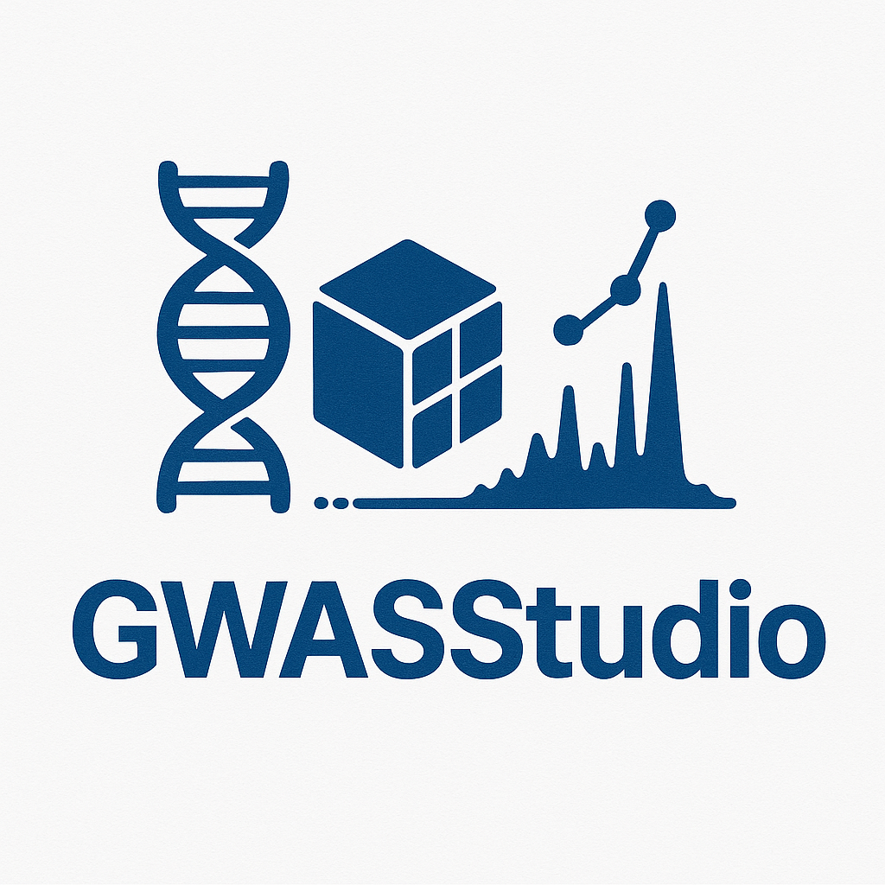

# GWASStudio: A Tool for Genomic Data Management




## Overview

GWASStudio is a comprehensive command-line interface (CLI) tool that serves as summary statistics store manager.
GWASStudio is a streamlined infrastructure for cross-dataset exploration of genomic summary statistics, enabling efficient management, querying, and analysis of large-scale GWAS and QTL data.

## Core Purpose

GWASStudio provides a unified interface across the SCDH infrastructure, handling the ingestion, storage, querying and export of genomic data using high performance technologies.

## Key Components

GWASStudio consists of several core functionalities:

### 1. Data Ingestion
- **Data Ingestion**: Imports summary statistics data and its metadata associated.
- **Support for Multiple Storage Options**: Works with both local filesystems and cloud storage (S3).

### 2. Data Querying
- **Flexible Search**: Enables searching metadata using template files.

### 3. Data Export
- **Selective Export**: Extracts subsets of data and its metadata associated based on genomic regions, SNPs, or the entire set of data.

## Technical Architecture

GWASStudio leverages several advanced technologies:

1. **TileDB**: A high-performance array storage engine that enables efficient storage and retrieval of genomic data.
2. **MongoDB**: Used for storing and querying metadata associated with genomic datasets.
3. **Dask** (optional): Provides distributed computing capabilities for processing large datasets.
4. **Python Ecosystem**: Built on Python with libraries like Click/Cloup for CLI interfaces, Pandas for data manipulation, and various genomics-specific tools.

## Installation

To get started with GWASStudio, follow these installation steps:
```bash
# Clone the repository
git clone https://github.com/ht-diva/gwasstudio
cd gwasstudio

# Create a virtual environment (recommended)
conda env create --file base_environment.yml
conda activate gwasstudio

# Install the package
make install

# Verify installation
gwasstudio --version
```

## Usage

Please refer to this [documentation](https://github.com/ht-diva/gwasstudio/tree/modify_readme/docs) for learning how to use it.

## Citation

Example files are derived from:

The variant call format provides efficient and robust storage of GWAS summary statistics. Matthew Lyon, Shea J Andrews, Ben Elsworth, Tom R Gaunt, Gibran Hemani, Edoardo Marcora. bioRxiv 2020.05.29.115824; doi: https://doi.org/10.1101/2020.05.29.115824
